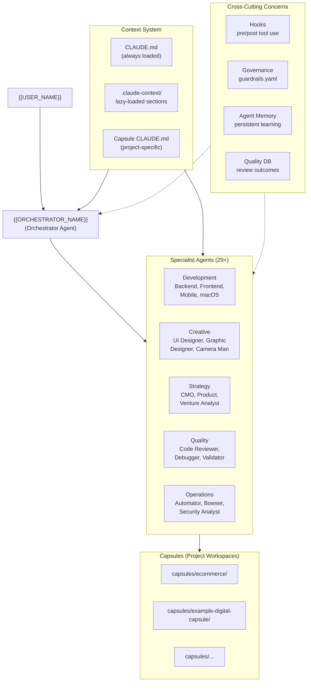

# Huxley Architecture

## System Overview

Huxley is a multi-agent orchestration framework built on top of [Claude Code](https://docs.anthropic.com/en/docs/claude-code). It transforms a single Claude Code session into a coordinated team of 29+ specialist agents, each with defined roles, skills, and constraints. The core philosophy is simple: **framework serves purpose, not vice versa.** Every architectural choice exists to move work from idea to deployment faster. The orchestrator ({{ORCHESTRATOR_NAME}}) receives requests, identifies the right specialists, delegates work, and coordinates the results -- while capsules keep projects isolated, hooks extend behavior at key points, and governance gates enforce quality without slowing things down.

## Architecture Diagram



## Core Concepts

### Capsules

A capsule is a self-contained project workspace. Every project -- whether an iOS app, an e-commerce store, or a browser automation pipeline -- lives in its own capsule directory under `capsules/<name>/`.

Each capsule contains:

| File/Directory | Purpose |
|---|---|
| `CLAUDE.md` | Project-specific instructions loaded when agents work inside this capsule |
| `specs/` | Requirements, design specifications |
| `src/` | Source code |
| `.env` | Isolated credentials (gitignored, never committed) |
| `product.yaml` | Capability roadmap and project vision |
| `standards.yaml` | Quality and compliance framework |

Capsules enforce **isolation**. An agent working on the ecommerce capsule sees ecommerce context, credentials, and specs -- not the ones from a different project. This prevents cross-contamination and lets multiple projects coexist in a single Huxley installation.

Templates for common project types exist in `templates/`:

- `capsule-base` -- Minimal starting point
- `web-dev-starter` -- React/Next.js web application
- `native-ios-app` -- Swift/SwiftUI iOS application
- `react-native-app` -- Cross-platform mobile app
- `automation-starter` -- n8n/workflow automation projects
- `ecommerce-brand` -- E-commerce brand with Shopify integration
- `research` -- Research and analysis projects

Create a capsule manually or use the `new-capsule` skill for automated setup.

### Agents

Agents are specialist roles defined as markdown files in `.claude/agents/`. Each file tells Claude Code: "When you invoke this agent via the Task tool, it has this identity, these skills, these boundaries, and these collaboration patterns."

There are 35 agents organized by function:

- **Development** (9): Backend, Frontend, Mobile, macOS, Automator, Bowser, 3D Developer, Game Developer, Reverse Engineer
- **Creative** (4): UI Designer, Graphic Designer, Camera Man, Studio Engineer
- **Strategic** (2): BOSS, System Architect
- **Quality** (3): Code Reviewer, Debugger, Validator
- **Business** (7): Venture Analyst, Business Analyst, Product Strategist, CMO, SEO Analyzer, Brand Specialist, YouTube Strategist
- **E-commerce & Product** (3): Ecomm Bro, Sourcerer, Formulator
- **Technical** (5): MCP Server Dude, Blockchain Agent, 2nd Brain Wizard, AI Nerd, Algo Wizard
- **Research** (1): Research Agent
- **Security** (1): Security Analyst

Agents run at different model tiers based on the cognitive demands of their work:

| Tier | Model | Used For |
|---|---|---|
| Opus | `opus` | Most agents — coding, strategy, business and creative leads (27 of 35) |
| Sonnet | `claude-sonnet-5` | Bowser, Validator, Studio Engineer, 3D Developer |
| Fable | `claude-fable-5` | Backend Developer, Code Reviewer, Debugger, System Architect |

See [docs/AGENTS.md](docs/AGENTS.md) for the full agent guide.

### Context Loading

Huxley uses **stratified context loading** to keep the orchestrator's prompt lean while preserving access to deep system knowledge.

The main `CLAUDE.md` at the project root is always loaded at session start. It contains core identity, routing rules, and protocol definitions. Deeper context lives in `.claude-context/` as separate files:

| File | Contents | Loaded When |
|---|---|---|
| `CLAUDE-architecture.md` | System patterns, capsule structure | Architecture discussions |
| `CLAUDE-orchestration.md` | Delegation rules, agent teams protocol | Routing, coordination |
| `CLAUDE-integrations.md` | Memory, APIs, browser automation | Integration work |
| `CLAUDE-navigation.md` | Capsule navigation intelligence | Navigating between capsules |
| `CLAUDE-operating.md` | Specs, validation, cost analysis | Completion requirements |
| `CLAUDE-strategy.md` | Portfolio map, learning protocol | Strategic decisions |

An `index.json` file defines **load triggers** -- keywords that signal when the orchestrator should pull in a context section. For example, if a user mentions "delegate" or "agent team," the orchestrator loads `CLAUDE-orchestration.md` for detailed routing rules.

This approach keeps token usage low during simple tasks while ensuring full context is available for complex operations.

### Hooks

Hooks are extension points that run before or after Claude Code tool execution. They are Python or shell scripts configured in `.claude/settings.json`.

Huxley ships with hooks for:

- **Post-tool-use** (Edit/Write): Tracks file modifications and task outcomes
- **Post-tool-use** (Task): Validates agent delegation results
- **Stop**: Codex diff review of the turn's code changes (toggle with `/auto-review`) and a git checkpoint
- **Session end**: Cleanup and capsule state updates

Hooks receive context via stdin as JSON (the tool invocation payload) and can influence behavior by their exit code. A hook returning non-zero on a `PreToolUse` event blocks the tool from executing.

See [docs/HOOKS.md](docs/HOOKS.md) for the full hook guide.

### Governance

Governance in Huxley is lightweight but non-negotiable where it matters.

`global/governance/guardrails.yaml` defines the operating model:

- **Privacy rules**: Never print secrets, never modify credentials, no external spend without approval
- **Consultation model**: The orchestrator provides technical analysis and alternatives; {{USER_NAME}} has final decision authority
- **Expert consultation**: A "Big 3" panel (BOSS + System Architect + {{ORCHESTRATOR_NAME}}) convenes on-demand for major architectural decisions
- **Code review pipeline**: the Stop hook runs a Codex diff review after every code-touching turn (`/auto-review` toggles it); a pre-commit gate is not bundled in v0.1

The quality pipeline flows: **Static Analysis -> AI Code Review -> Findings**. Critical findings get fixed before the work ships; major and minor findings are logged in the review output.

### Skills

Skills are specialized knowledge bundles that give agents domain expertise. They live in `.claude/skills/` and are referenced from agent markdown files.

A skill consists of:

- `SKILL.md` -- Description, trigger conditions, allowed tools, and usage instructions
- Reference documents -- Technical documentation, patterns, and examples the agent can consult

Skills come from two sources:

1. **Custom skills** -- Built for Huxley-specific workflows (new-capsule, apple-provision, media-engine, etc.)
2. **Community skills** -- Installed from the [skills.sh](https://skills.sh) ecosystem and cloned to `.claude/skills/community/`

Skills are not useful until wired to agents. An agent's markdown file must reference its skills for them to take effect.

See [docs/SKILLS.md](docs/SKILLS.md) for the full skills guide.

### Additional Extension Points

**Slash commands** (`.claude/commands/`): Reusable workflow commands invoked with `/command-name`. Examples include `/code-review`, `/validate`, `/debug`, and capsule-specific navigation shortcuts.

**Output styles** (`.claude/output-styles/`): Context-specific output formatting modes like `debug-forensics`, `performance`, `testing`, `deployment`, and `browser-automation`. These modify how agents approach and present their work.

**Sharp edges** (`.claude/sharp-edges/`): Per-technology pitfall documentation in YAML format. Each entry documents a gotcha with severity, detection patterns (regex/AST), explanation, fix, and code examples. Agents consult these to avoid known production failures.

## Request Flow

Here is what happens when {{USER_NAME}} says: **"Build me a login page"**

1. **{{ORCHESTRATOR_NAME}} receives the request** in the main Claude Code session. The core `CLAUDE.md` is already loaded, providing routing rules and agent definitions.

2. **Context loading check.** The request involves frontend and backend work. If deeper context is needed (e.g., capsule-specific patterns), {{ORCHESTRATOR_NAME}} loads the relevant `.claude-context/` section.

3. **Agent routing.** {{ORCHESTRATOR_NAME}} consults the specialist routing map:
   - Login UI -> **Frontend Developer** (React components, form validation)
   - Authentication API -> **Backend Developer** (auth endpoints, session management)
   - Optionally: **UI Designer** (if wireframes are needed first)

4. **Pre-tool-use hooks fire.** Before delegating via the Task tool, hooks execute:
   - Agent memory retrieval (ERM-lite) -- searches for relevant past patterns ("authentication patterns", "login implementation") and surfaces them
   - Delegation routing reminders -- confirms the right agent is being invoked

5. **Delegation via Task tool.** {{ORCHESTRATOR_NAME}} invokes agents sequentially or in parallel:
   ```
   Task(subagent_type="🎨 Frontend Developer", prompt="Build a login page with email/password fields, validation, and error states...")
   Task(subagent_type="🏛️ Backend Developer", prompt="Create authentication API endpoints for login with JWT tokens...")
   ```
   Each agent runs in its own subprocess with its full agent definition, skills, and capsule context loaded.

6. **Agents execute.** Each specialist:
   - Reads the capsule's `CLAUDE.md` for project-specific constraints
   - Queries Context7 (MCP) for up-to-date framework documentation
   - Consults its sharp-edges file to avoid known pitfalls
   - Implements the solution using Read, Edit, Write, and Bash tools

7. **Post-tool-use hooks fire.** After each agent completes:
   - Completion claims are validated against the files that actually changed
   - Delegation validation hook checks the result

8. **Code review pipeline** (post-turn). After each code-touching turn:
   - The Stop hook triggers the Codex diff review
   - Static analysis + AI review runs on the diff
   - Findings are categorized (Critical/Major/Minor)
   - Critical findings are surfaced for an immediate fix; others are logged

9. **{{ORCHESTRATOR_NAME}} synthesizes results** and reports back to {{USER_NAME}} with a summary of what was built, any issues found, and next steps.

## Directory Structure

```
Huxley/
├── CLAUDE.md                      # Core orchestrator instructions (always loaded)
├── .claude/
│   ├── agents/                    # 35 specialist agent definitions
│   │   ├── backend-specialist.md
│   │   ├── frontend-specialist.md
│   │   ├── mobile-dev.md
│   │   └── ...
│   ├── commands/                  # Slash commands (/code-review, /validate, etc.)
│   ├── output-styles/             # Context-specific output formatting
│   ├── sharp-edges/               # Per-technology pitfall documentation
│   ├── skills/                    # Skill bundles
│   │   ├── new-capsule/       # Custom skills
│   │   ├── apple-provision/
│   │   ├── frontend-testing/
│   │   ├── community/             # Installed community skills
│   │   │   ├── vercel-labs/
│   │   │   ├── anthropic/
│   │   │   └── ...
│   │   └── ...
│   └── settings.json              # Hook configuration, permissions
├── .claude-context/               # Stratified context (lazy-loaded)
│   ├── index.json                 # Load triggers and metadata
│   ├── CLAUDE-architecture.md
│   ├── CLAUDE-orchestration.md
│   ├── CLAUDE-integrations.md
│   ├── CLAUDE-navigation.md
│   ├── CLAUDE-operating.md
│   └── CLAUDE-strategy.md
├── capsules/                      # Project workspaces
│   ├── ecommerce/
│   │   ├── CLAUDE.md
│   │   ├── specs/
│   │   ├── src/
│   │   └── .env
│   ├── example-digital-capsule/
│   └── ...
├── global/
│   ├── governance/
│   │   └── guardrails.yaml        # Risk classification, privacy rules
│   ├── config/
│   │   └── port-registry.yaml     # Service port assignments
│   └── docs/                      # Shared reference documentation
├── templates/                     # Capsule starter templates
│   ├── capsule-base/
│   ├── web-dev-starter/
│   ├── native-ios-app/
│   └── ...
├── tools/                         # CLI tools and utilities
│   ├── media-engine/              # Image/video/vector pipeline
│   ├── apple_provision.py         # Apple Developer automation
│   ├── tiktok.py                  # TikTok API client
│   └── ...
└── monitoring/                    # System health and quality tracking
    ├── quality.db                 # SQLite DB for review/task outcomes
    └── health.sh                  # Daily health check
```

## Customization Points

### What you should modify

- **`CLAUDE.md`** -- Your orchestrator's identity, routing rules, and protocols. This is your system's brain.
- **`.claude/agents/*.md`** -- Add, remove, or modify specialist agents. Each file is a self-contained role definition.
- **`.claude-context/`** -- Add or modify stratified context sections for domain-specific knowledge.
- **`capsules/`** -- Create project capsules for your work. Each gets its own isolated context.
- **`.claude/skills/`** -- Add skills to give agents new capabilities.
- **`.claude/commands/`** -- Create slash commands for frequently used workflows.
- **`.claude/sharp-edges/`** -- Document technology-specific pitfalls your agents should avoid.
- **`global/governance/guardrails.yaml`** -- Define your own governance rules and quality gates.
- **`.claude/settings.json`** -- Configure hooks, permissions, and model selection.
- **`templates/`** -- Create capsule templates for project types you build repeatedly.

### What runs as-is

- **Hook infrastructure** -- The hook scripts in `global/claude-config/hooks/` handle lifecycle events. Modify the *configuration* in `settings.json`, not usually the hook scripts themselves.
- **Context loading mechanism** -- The `index.json` and lazy-loading pattern works without changes. Add sections by creating new `.claude-context/` files and adding entries to the index.
- **Task tool delegation** -- Claude Code's built-in Task tool handles agent subprocess spawning. You configure agents, not the delegation mechanism.

## Design Decisions

### Why markdown for agent definitions?

Agent files are Claude Code's native format for subagent definitions. Markdown is human-readable, version-controllable, and supports frontmatter for structured metadata (model tier, mesh routing, tags). No build step, no compilation, no schema migration -- edit the file and the agent changes immediately.

### Why stratified context loading?

A single monolithic `CLAUDE.md` with everything in it wastes tokens on irrelevant context. A fully dynamic system that loads nothing upfront would miss critical routing rules. Stratified loading is the middle ground: core instructions always load (~800 lines), deep context loads on-demand based on topic triggers. This keeps 80% of sessions lean while ensuring 100% of sessions have access to full context when needed.

### Why hooks over a plugin system?

Hooks are simple: a script runs, it gets JSON on stdin, it returns an exit code. No plugin API to maintain, no versioning headaches, no SDK. Python and shell scripts are universally understood. The tradeoff is less power (hooks can't modify tool behavior mid-execution), but for the use cases that matter -- logging, memory retrieval, validation, notifications -- hooks are sufficient and dramatically simpler.

### Why capsules instead of monorepo projects or branches?

Capsules provide **credential isolation** (each project has its own `.env`), **context isolation** (each project has its own `CLAUDE.md`), and **conceptual isolation** (agents working on one project do not see another project's specs or code). Git branches share credentials and global state. Monorepo projects share context. Capsules share *agents and tools* while isolating everything project-specific.

### Why model tiering for agents?

Not all agent work requires the same cognitive capability. Code implementation benefits from Opus-level reasoning. SEO analysis or brand guidelines work fine with Haiku. Tiering lets you allocate model budget where it matters most. The `model:` field in agent frontmatter makes this explicit and easy to adjust per-agent.
```

---