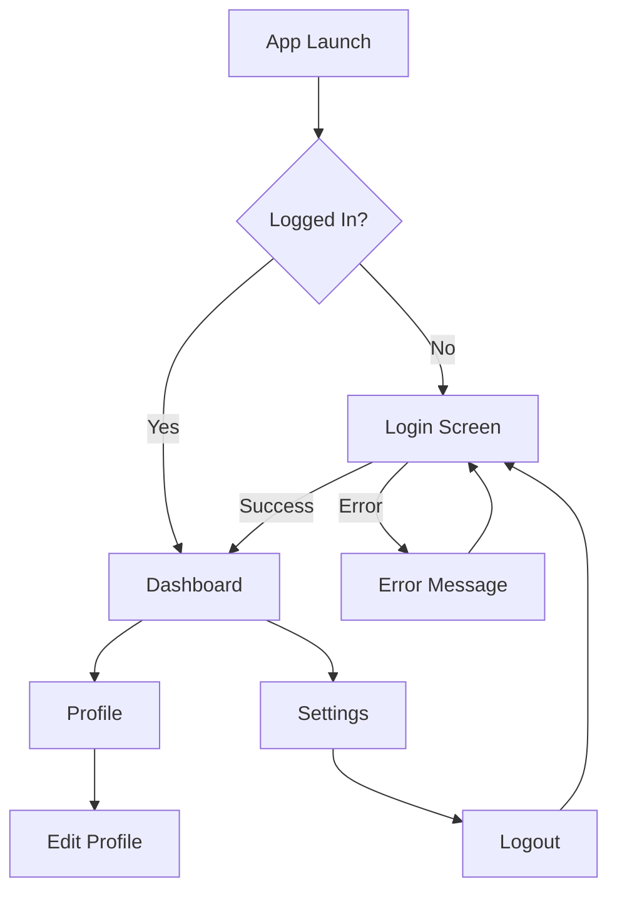
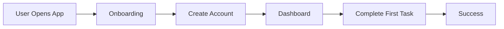
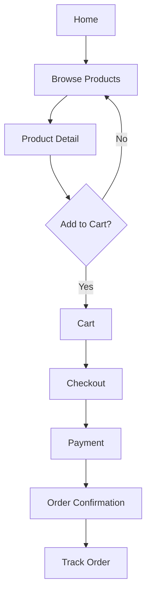

# Wireframing Guide

Complete guide to wireframing in Huxley for iOS native applications.

## Overview

Wireframing is the **first step** in the UI Designer workflow. Before writing any SwiftUI code, create low-fidelity wireframes to:

- Map user flows
- Define information architecture
- Plan navigation structure
- Establish content hierarchy
- Get stakeholder approval

## Tools

### 1. Mermaid Diagrams (User Flows)



### 2. Text-Based Wireframes

```
┌─────────────────────────────┐
│      Login Screen           │
├─────────────────────────────┤
│                             │
│         [App Logo]          │
│                             │
│  ┌───────────────────────┐  │
│  │ Email Address         │  │
│  └───────────────────────┘  │
│                             │
│  ┌───────────────────────┐  │
│  │ Password              │  │
│  └───────────────────────┘  │
│                             │
│  ┌───────────────────────┐  │
│  │      Log In           │  │
│  └───────────────────────┘  │
│                             │
│  [Forgot Password?]         │
│                             │
│  ─────────── OR ───────────  │
│                             │
│  [ Sign in with Apple ]     │
│                             │
│  Don't have an account?     │
│  [Sign Up]                  │
│                             │
└─────────────────────────────┘
```

### 3. Markdown Descriptions

For complex screens, use structured markdown:

## Dashboard Screen

**Navigation:**
- Top: Navigation bar with app title and profile button
- Bottom: Tab bar (Home, Explore, Notifications, Profile)

**Content Areas:**
1. **Header Section** (fixed, non-scrolling)
   - Welcome message
   - Quick stats (3 cards in horizontal row)

2. **Main Content** (scrollable)
   - Recent activity feed
   - Infinite scroll with pull-to-refresh

3. **Floating Action Button** (bottom-right)
   - Primary action: "New Post"

**States:**
- Loading: Skeleton screens for content cards
- Empty: "No activity yet" message with CTA
- Error: Retry button with error message

## Wireframing Process

### Step 1: Define User Flows

Start with the primary user journey:



Document all flows:
- Happy path (success)
- Error paths (failures, validation)
- Edge cases (network offline, slow connection)

### Step 2: Screen Inventory

List all screens needed:

| Screen | Purpose | Entry Point | Exit Point |
|--------|---------|-------------|------------|
| Splash | App launch | App icon tap | Auto-navigate |
| Onboarding | First-time intro | Splash (first launch) | Skip or Complete |
| Login | Authentication | Onboarding, Logout | Dashboard |
| Dashboard | Main hub | Login | All features |
| Profile | User details | Dashboard tab | Back |
| Settings | Configuration | Dashboard | Back |

### Step 3: Create Wireframes

For each screen, create a text-based wireframe:

**Template:**
```
┌─────────────────────────────┐
│  [Screen Name]              │
├─────────────────────────────┤
│                             │
│  [Navigation Bar]           │
│                             │
│  ┌───────────────────────┐  │
│  │ Component 1           │  │
│  └───────────────────────┘  │
│                             │
│  ┌───────────────────────┐  │
│  │ Component 2           │  │
│  └───────────────────────┘  │
│                             │
│  [Primary Action Button]    │
│                             │
└─────────────────────────────┘
```

### Step 4: Specify Interactions

Document gestures and interactions:

**Login Screen Interactions:**
- Tap email field → Show keyboard, cursor in field
- Tap password field → Show keyboard with secure entry
- Tap "Forgot Password?" → Navigate to password reset
- Tap "Log In" → Show loading, validate, navigate or error
- Tap "Sign Up" → Navigate to registration
- Swipe down → Dismiss keyboard

### Step 5: Define States

Every screen has multiple states:

**States to Document:**
1. **Default** - Initial screen state
2. **Loading** - Data fetching
3. **Empty** - No content
4. **Error** - Something went wrong
5. **Success** - Happy path
6. **Partial** - Some content loaded

**Example (Dashboard States):**

```
Default State:
┌─────────────────────────────┐
│  [Dashboard]                │
├─────────────────────────────┤
│  Welcome back, John!        │
│                             │
│  [Stats Card 1] [Card 2] [3]│
│                             │
│  Recent Activity:           │
│  ┌───────────────────────┐  │
│  │ Activity Item 1       │  │
│  ├───────────────────────┤  │
│  │ Activity Item 2       │  │
│  └───────────────────────┘  │
└─────────────────────────────┘

Loading State:
┌─────────────────────────────┐
│  [Dashboard]                │
├─────────────────────────────┤
│  Welcome back, ...          │
│                             │
│  [█████] [█████] [█████]    │
│                             │
│  Recent Activity:           │
│  ┌───────────────────────┐  │
│  │ ▓▓▓▓▓▓▓▓▓▓▓▓▓▓▓▓▓▓▓  │  │
│  ├───────────────────────┤  │
│  │ ▓▓▓▓▓▓▓▓▓▓▓▓▓▓▓▓▓▓▓  │  │
│  └───────────────────────┘  │
└─────────────────────────────┘

Empty State:
┌─────────────────────────────┐
│  [Dashboard]                │
├─────────────────────────────┤
│  Welcome, John!             │
│                             │
│  [Stats: 0] [0] [0]         │
│                             │
│  No activity yet            │
│                             │
│  Get started by creating    │
│  your first item.           │
│                             │
│  [Create Item Button]       │
│                             │
└─────────────────────────────┘
```

## Information Architecture

Document how information is organized:

```
App Structure:
├── Tab Bar (Main Navigation)
│   ├── Home
│   │   ├── Feed
│   │   ├── Item Detail
│   │   └── Search
│   ├── Explore
│   │   ├── Categories
│   │   └── Category Detail
│   ├── Notifications
│   │   ├── All Notifications
│   │   └── Notification Settings
│   └── Profile
│       ├── User Profile
│       ├── Edit Profile
│       └── Settings
│           ├── Account Settings
│           ├── Privacy Settings
│           └── About
└── Modals (Overlays)
    ├── Login
    ├── Sign Up
    └── Create Item
```

## Navigation Patterns

### Pattern 1: Tab Bar Navigation (Primary)

```
┌─────────────────────────────┐
│  Screen Content             │
│                             │
│                             │
├─────────────────────────────┤
│ [Home] [Explore] [⊕] [🔔] [@]│
└─────────────────────────────┘
```

**When to use:** Main app sections, always visible

### Pattern 2: Stack Navigation (Secondary)

```
[List] → [Detail] → [Edit] → [Confirm]
```

**When to use:** Hierarchical content, back navigation

### Pattern 3: Modal Presentation

```
Base Screen
    ↓ Present modally
[Modal Screen]
    ↓ Dismiss
Base Screen
```

**When to use:** Temporary tasks, forms, confirmations

## Deliverables Checklist

Before moving to SwiftUI implementation, ensure you have:

- [ ] Complete user flow diagram (Mermaid)
- [ ] Screen inventory (all screens listed)
- [ ] Wireframe for each screen
- [ ] All states documented (default, loading, empty, error)
- [ ] Interactions specified (taps, gestures)
- [ ] Navigation structure defined
- [ ] Information architecture documented
- [ ] Edge cases considered
- [ ] Stakeholder approval

## Example: E-Commerce App Wireframes

### User Flow



### Home Screen Wireframe

```
┌─────────────────────────────┐
│  [MyShop]            [🔍][🛒]│
├─────────────────────────────┤
│                             │
│  ┌───────────────────────┐  │
│  │ [Banner Carousel]     │  │
│  │ • • •                 │  │
│  └───────────────────────┘  │
│                             │
│  Categories:                │
│  [👕] [👗] [👟] [👜] [⌚]    │
│                             │
│  Featured Products:         │
│  ┌────────┐ ┌────────┐     │
│  │[Image] │ │[Image] │     │
│  │ Name   │ │ Name   │     │
│  │ $99    │ │ $149   │     │
│  └────────┘ └────────┘     │
│                             │
│  [View All Products →]      │
│                             │
└─────────────────────────────┘
```

### Product Detail Wireframe

```
┌─────────────────────────────┐
│  [←]              [🔍][❤️][🛒]│
├─────────────────────────────┤
│                             │
│  ┌───────────────────────┐  │
│  │                       │  │
│  │   [Product Image]     │  │
│  │   • • • • •           │  │
│  │                       │  │
│  └───────────────────────┘  │
│                             │
│  Product Name               │
│  ⭐⭐⭐⭐⭐ (4.5) 120 reviews  │
│                             │
│  $99.99                     │
│                             │
│  Size: [S] [M] [L] [XL]     │
│  Color: [⚫][⚪][🔴][🔵]     │
│                             │
│  Description:               │
│  Lorem ipsum dolor sit...   │
│                             │
│  ┌───────────────────────┐  │
│  │  Add to Cart          │  │
│  └───────────────────────┘  │
│                             │
└─────────────────────────────┘
```

## Tips

### Do's ✅
- Keep wireframes simple and low-fidelity
- Focus on layout and structure, not visuals
- Document all states (loading, empty, error)
- Include annotations for interactions
- Get feedback early and often
- Use consistent spacing and alignment

### Don'ts ❌
- Don't add colors or final styling
- Don't spend time on pixel-perfect alignment
- Don't skip edge cases and error states
- Don't forget about empty states
- Don't assume users understand your navigation

## Next Steps

After wireframing is complete:

1. **Review with stakeholders** - Get approval on structure
2. **Move to SwiftUI** - Implement in Xcode with Previews
3. **Design System** - Apply colors, typography, spacing
4. **Validation** - Use 5 design validation tools
5. **Handoff** - Deliver to Mobile Dev for integration

---

**Related Documentation:**
