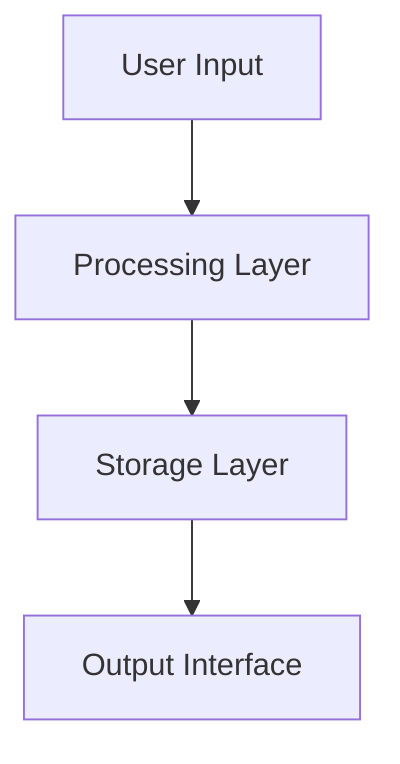

# System Design Handoff Template

## Design Overview
**System Name:** [Project Name]
**Platform:** [iOS/Web/Automation/E-commerce/Infrastructure]
**Complexity:** [Simple/Medium/Complex]

## System Architecture

### Core Components
- **Component 1:** [Purpose and responsibilities]
- **Component 2:** [Purpose and responsibilities]
- **Component 3:** [Purpose and responsibilities]

### Data Flow


### Integration Points
- **External APIs:** [List required integrations]
- **Internal Systems:** [Huxley dependencies]
- **Data Sources:** [Required data connections]

## Platform-Specific Considerations

### Technical Requirements
- **Framework:** [React/SwiftUI/n8n/Shopify/Docker]
- **Dependencies:** [Required libraries/tools]
- **Environment:** [Development/staging/production needs]

### Performance Constraints
- **Response Time:** [Target performance metrics]
- **Scalability:** [Expected load/growth requirements]
- **Resource Limits:** [Memory/storage/bandwidth constraints]

## Implementation Specifications

### API Contracts
```yaml
endpoints:
  - path: /api/endpoint
    method: GET
    input: { field: type }
    output: { field: type }
```

### Data Models
```yaml
models:
  - name: EntityName
    fields:
      - field_name: data_type
      - field_name: data_type
```

### User Interface Requirements
- **Screen/Page 1:** [Layout and interaction requirements]
- **Screen/Page 2:** [Layout and interaction requirements]
- **Navigation Flow:** [User journey mapping]

## Quality Requirements

- [ ] Minimal functional validation
- [ ] Basic error handling
- [ ] Stub documentation

- [ ] Full test coverage
- [ ] Production-ready error handling
- [ ] Complete documentation
- [ ] Performance optimization
- [ ] Security review
- [ ] Integration testing

## Implementation Routing

### Primary Builder
**Recommended Specialist:** [Agent Name]
**Reasoning:** [Why this specialist is optimal]

### Supporting Specialists
- **Specialist 1:** [Role in implementation]
- **Specialist 2:** [Role in implementation]

### Estimated Timeline

## Risks & Considerations
- **Technical Risks:** [Potential implementation challenges]
- **Dependencies:** [External blockers or requirements]
- **Assumptions:** [Key assumptions made in design]

---

## {{ORCHESTRATOR_NAME}} Orchestration Notes
**Governance Classification:** [Green/Yellow/Red]
**Context Bridge Requirements:** [What context needs preservation]
**Quality Gates:** [What validation is required between design and implementation]

---

*Generated by System Architect | Orchestrated by {{ORCHESTRATOR_NAME}}*